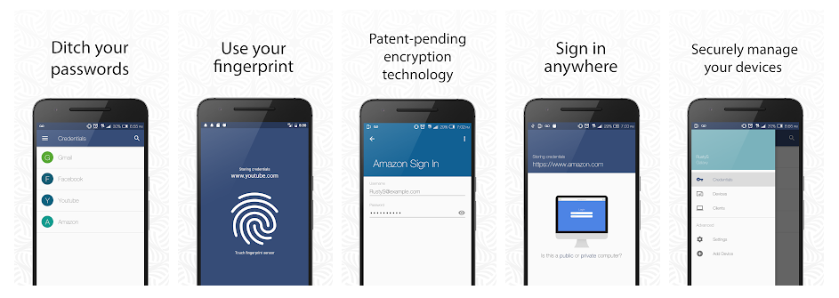

[Hallpass](http://www.hallpass.io/) is a password manager focused on security via biometrics. It allows users to sign in to websites on any device by using the fingerprint sensor on their phone.

Hallpass was conceived of at [Hack-DFW](https://www.hackdfw.com/) 2016 as a way to consolidate password management without having to rely on a master password. It uses AES-256 encryption and supports authorizing and deauthorizing multiple devices for each user.

## Stack

### Backend

[Node.js](https://nodejs.org/en/about/) in combination with [socket.io](https://socket.io/) was used to build the api and support push/pull connections.

[MongoDB](https://www.mongodb.com/) was used for efficient data retrieval

### Frontend

[Kotlin](https://kotlinlang.org/) was used to develop the native Android app
[Swift](https://developer.apple.com/swift/) was used to develop the native iOS app

