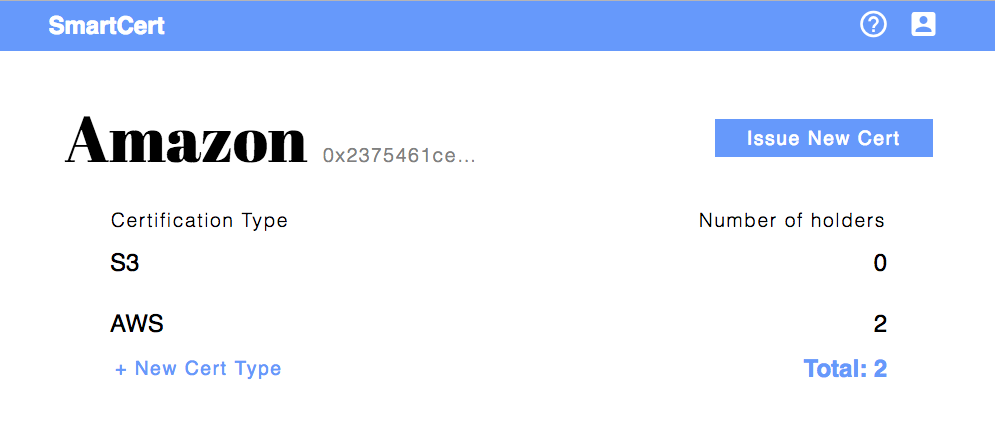

[SmartCert](https://www.smartcert.app/) is a decentralized application that allows corporations to issue certifications and individuals to provably display those certifications.

Upon receiving a certification (from Amazon for example), the burden of proof lies with whomever is trying to verify that you hold that certification. A prospective employer would need to contact Amazon and provide the number associated with your certification to verify that you actually received it.

SmartCert utilizes the blockchain to make this process trust-less. The certifications are distributed from an issuer address to a holder address. Verification then becomes as simple as signing a message to prove ownership of the address holding the certification.

## Stack

[React](https://reactjs.org/) was used to build the views and display blockchain data.

[Redux](https://redux.js.org/) was used as the state container along with [Drizzle](https://github.com/trufflesuite/drizzle) to sync with the state of the deployed smart contract. 

[Solidity](http://solidity.readthedocs.io/) was used to develop the smart contract containing the business logic.

[Truffle](https://truffleframework.com/) was used to deploy SmartCert on the Ropsten test net.

# Contribute

I'm open to any and all contribution! Find the repo [here](https://gitlab.com/sliptype/smartcert)
