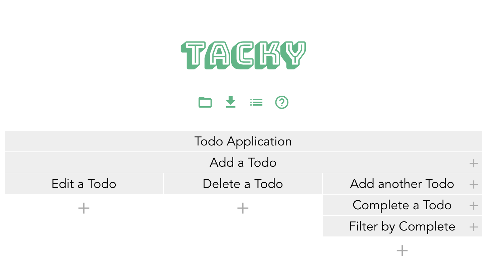
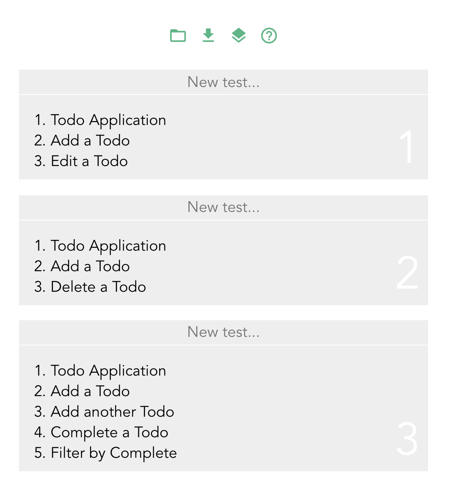

[Tacky](http://www.the-tacky.com/) is a scenario discovery and management tool. It allows you to create a hierarchical description of user interactions with a system and transform it into a list of discrete test cases.

## Motivation

The linear way of writing test scenarios leaves a lot to be desired. Representing the state of a system without abstracting away the steps to get there becomes tedious and error-prone. 

## Usage

In Tacky, you create rows (known as layers) that contain steps (known as cases). A layer can have multiple cases. For example, a todo app could look like this:

Regarding the above as a tree, the paths that need to be followed to exhaustively test the system are those from root to leaf. A tester can mark the branches as they are completed and know at a glance which paths still need testing. Tacky can also display the branches as a list of discrete test cases:

## Stack

[Vue.js](https://vuejs.org/) was chosen because of how quickly a prototype can be built with it. There is just enough "magic" to make putting together an application a breeze.

[Vuex](https://vuex.vuejs.org/) was used as the state container. Having a centralized store makes it easy to save and share Tacky boards.

[Express](https://expressjs.com/) was used to serve the application.

# Contribute

I'm open to any and all contribution! Find the repo [here](https://gitlab.com/sliptype/tacky)